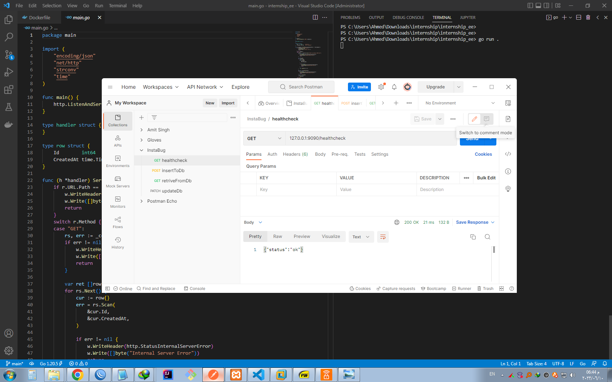
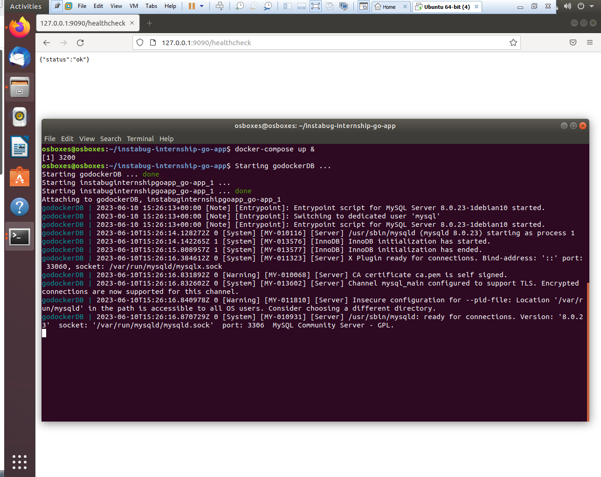
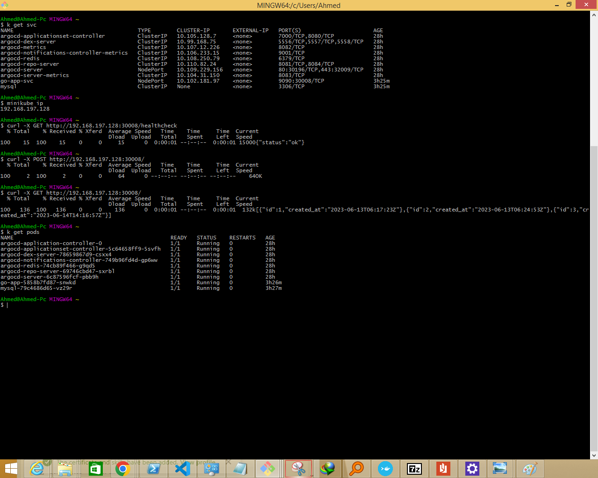

# This repo has full documentation to every step I have taken to solve the Intabug Infrastructure Internship 2023 assignment

The assignment is a simple stateful web app with simple CRUD functionality written in Go Lang and uses mysql as a Database.

# Table of content
1. [Project requirements](#req)
2. [Phase 1 ( run the go api app locally )](#local)
3. [Phase 2 ( containerizing the go api app Using Docker)](#docker)
4. [Phase 3 ( building CI to push the go api app to dockerhub using Jenkins)](#jenkins)
5. [Phase 4 ( deploying the go api app with Kubernetes)](#Kubernetes)
6. [Phase 5 ( deploying the go api app with Helm Charts)](#helm)
7. [Phase 6 ( building CD of the go api app Using ArgoCD and Helm Charts)](#argocd)
8. [Time for some Screen Shots](#screen_shots)

## requirements <a name="req"></a>

- Dockerfile that build the app and try to make it as lightweight as you can.
- Pipeline job (jenkinsfile) to build the app using dockerfile and reports if any errors happened in the build. The output of the build step should be a docker image pushed to dockerhub or any docker repo you want.
- Docker compose file that contains both application and mysql database so you can run the app locally.
- Helm manifests for kubernetes to deploy the app using them on kubernetes with adding config to support high availability and volume persistence and exposing service to the public (you can use minikube to test).

    ## As a bonus you can
    - Add autoscaling manifest for number of replicas. 
    - Add argocd app that points to helm manifests to apply gitops concept. 
    - Secure your containers as much as you can. 
    -  Fix a bug in the code that would appear when you test the api (all needed information of api is in the readme file)

## Phase 1 ( run the go api app locally )<a name="local"></a>

- Make sure you have MYSQL installed and running before running the go app.

    -  You can download and install MYSQL from [MYSQL Downloads Page](https://dev.mysql.com/downloads/).
    - Or you can Use [XAMP](https://www.apachefriends.org/).
- Define the 4 required Environment Variables used by the app located in the [APP-Guide.md](APP-Guide.md)

    ```bash
    export MYSQL_HOST="127.0.0.1"
    export MYSQL_USER="root"
    export MYSQL_PASS="root"
    export MYSQL_PORT="3306"

    ```
- Install Go using the [officail website](https://go.dev/doc/install).
- Run this command to install all the dependency and launch the app .

    ```bash
    go run .
    ```
- Test the Endpoints :
    - Either By [postman](https://www.postman.com/).
    - Or [Curl](https://curl.se/).
    - You can test the `healthcheck` endpoint in the browser by going to this url `127.0.0.1:9090/healthcheck` if all the setup is correct you should be getting `{"status":"ok"}`

## Phase 2 ( containerizing the go api app Using Docker)<a name="docker"></a>

- Make sure to have Docker installed using their [official website](https://docs.docker.com/get-docker/)
- My first attempt was successful in creating, building and testing a docker image for the go api app but the size was `330 MB`
- So as a bonus I made use of the [Distroless images](https://github.com/GoogleContainerTools/distroless) and reduced the size to become `9 MB`

    - You can build a docker image using this command and tag it using the `-t`
        ```bash
        docker build -f ./docker_files/Dockerfile -t go-app:min .
        ```
	- Before running the `go-app` container, We have to run a MYSQL container first, passing all the required MYSQL Environment Variables
        ```bash
        docker run -d -p 3306:3306 --name mysql-docker-container -e MYSQL_ROOT_PASSWORD=root -e  MYSQL_USER=root -e MYSQL_PASSWORD=root mysql/mysql-server:latest
        ```
    - After building the `go-app` image, it is time to test it, passing the App required Environment Variables
        ```bash
        docker run -p 9090:9090 --name go-app -e MYSQL_PASS=root -e MYSQL_USER=root -e MYSQL_HOST=127.0.0.1 -e MYSQL_PORT=3306 go-app:min
        ```

- Wrote a `docker-compose.yml` file to eaisly spin up the go app and the mysql db all together with one command

    - docker-compose doesn't come installed with Docker so you have to install it manually from [here](https://docs.docker.com/compose/install/standalone/)
    - You can run a docker compose file using the following command
        ```bash
        docker-compose up
        ```
- Side Note: 
    - once the go app starts, it tries to connect to MYSQL, that's why we launch the mysql container first but in case of docker-compose. both go-app and mysql containers start immediately, and the mysql container haven't loaded yet so the go-app crashes and to fix this issue, I implemented two approaches:
        - Added a `healthcheck` command to make sure the db is up and ready.
        - Added a `depends_on` tag in the go-app section to force the container to wait till the healthcheck is true and then start the container
    - I used -f with `docker build` to specifiy the location of Dockerfile and `.` to specify the location which includes the files Dockerfile deals with

## Phase 3 ( building CI to push the go api app to dockerhub using Jenkins)<a name="jenkins"></a>

- Make sure to have Jenkins installed using [their website here](https://www.jenkins.io/doc/book/installing/) .

- You have to rename the docker image to include you dockerhub username

    - You can rename a docker image using this command
    ```bash
    docker tag go-app:min ahmedsoliman202/go-app:min
    ```
    - You can push a docker image to dockerhub using this command
    ```bash
    docker push ahmedsoliman202/go-app:min
    ```
- Created image can be found here [go-app-image:min](https://hub.docker.com/repository/docker/ahmedsoliman202/go-app/general)
- Side Note: 
    - in order to use Jenkins to build and push docker images the host pc must have docker installed and in my case I accessed the Jenkins container and mounted docker socket volume into the Jenkins container to enable the execution of Docker commands on the host machine

## Phase 4 ( deploying the go api app with Kubernetes)<a name="Kubernetes"></a>

- Make sure you have `kubectl`,`minikube` installed from the [Kubernetes docs](https://kubernetes.io/docs/tasks/tools/)

    - You also must have a `minikube driver` installed, in my case I used `Virtual box`
    - In order to interact with the minikube cluster you have have to start it using this command
        ```bash
        minikube start --driver=virtualbox
        ```
- Since the go-app depends on the Mysql, We have to apply MYSQL kubernetes manifest first using this command

    ```bash
     k create -f ./kubernetes_mainfests/mysql-pv.yaml
     k create -f ./kubernetes_mainfests/mysql-deployment.yaml
    ````
    - To see if the pod was created successfully and running using this command to list all the pods in a cluster node
        ```bash
        kubectl get pods
        ```
- Second step is to deploy the go api app using this command
    ```bash
     k create -f ./kubernetes_mainfests/app-deployment.yaml
    ````
- I defined a k8 `Service` resource in `app-deployment.yaml` of type `NodePort` so that I can Expose the go api app to the public

    - In order to access the go api app publicly, We have to get the cluster ip using this command
        ```bash
        minikube ip
        ```
    - I have set the `NodePort` to `30008` so we can use the cluster ip along with the nodeport to test the app, The url will be something like `http://192.168.197.128:30008`

- Side Note: 
    - I have set the `MYSQL_HOST` in the `app-deployment.yaml` to `mysql` because We are using the concept of [DNS and Namespaces](https://kubernetes.io/docs/concepts/services-networking/dns-pod-service/#:~:text=Kubernetes%20creates%20DNS%20records%20for,by%20name%20rather%20than%20IP.) to connect pods together
    - I have set the `replicas` in the `app-deployment.yaml` to `5` to achieve high availability of the service.
    - I have defined a `PersistentVolume` resource in `mysql-pv.yaml` to achieve volume persistence.

## Phase 5 ( deploying the go api app with Helm Charts)<a name="helm"></a>

- Make sure to have Helm installed from [official docs](https://helm.sh/docs/intro/install/).

- You can create a `Helm Chart` using this command 
    ```bash
    helm create chartnamehere
    ```
- You can verify the helm charts before deploying by generating the template using this command
    ```bash
    helm template --output-dir ./charts-test-templates --values=./helm_charts/go-app/values.yaml ./helm_charts/go-app/
    ```
- Like we did in kubernetes, We will deploy db first using this command
    ```bash
    helm install mysql --values=./helm_charts/db/values.yaml ./helm_charts/db
    ```
- Then we deploy go api app using this command
    ```bash
    helm install go-app --values=./helm_charts/go-app/values.yaml ./helm_charts/go-app/
    ```
- Side Note:
    - I have defined a `HorizontalPodAutoscaler` resource in `hpa.yaml` to achieve autoscaling and high availability of the service. 

## Phase 6 ( building CD of the go api app Using ArgoCD and Helm Charts)<a name="argocd"></a>

- First thing to do before installing Argocd is to create a kubernete namespace using this command 
    ```bash
    kubectl create namespace argocd
    ```
- Make sure to have ArgoCD installed from [official docs](https://argo-cd.readthedocs.io/en/stable/getting_started/).

    - You can get the Url where Argocd is hosted, it will be something like `http://192.168.197.128:30196` by using this command
        ```bash
        minikube service argocd-server -n argocd --url
        ```
    - Default username is `admin` and the password can be loacated using this command
        ```bash
        kubectl -n argocd get secret argocd-initial-admin-secret -o jsonpath='{.data.password}' | base64 -
        ```
- To interact with Argocd, You have to install ArgoCD CLI:
    - from [ArgoCD CLI official docs](https://argo-cd.readthedocs.io/en/stable/getting_started/)
    - Or you can download the release from their [github release page](https://github.com/argoproj/argo-cd/releases) and make sure the version you installed matches the release version.
    - After installing argocd cli, You need to login because the cli doesn't know where to find the instance running argocd
        - Once Argocd Cli is installed, We login to Argocd using the service url from above by using this command
        ```bash
        argocd login 192.168.197.128:30196
        ```
        - A good place to find reliable examples on how to use the CLi, creating applications, Using UI, can be found [Offcial Docs](https://argo-cd.readthedocs.io/en/stable/getting_started/)

- Like we did in kubernetes & Helm We will deploy db first using this command
    ```bash
    argocd app create -f ./argocd_files/mysql-mainfest.yaml
    ```
- Then we deploy go api app through Argocd Cli using this command 
    ```bash
    argocd app create -f ./argocd_files/go-app-mainfest.yaml
    ```
- We can access the go app, it will be something like `http://192.168.197.128:30008` using this command
    ```bash
    minikube service go-app-svc -n argocd --url
    ```
- Side Note:
    - If you are using windows, make sure to rename the downloaded argocd cli from `argocd-windows-amd64.exe` to `argocd.exe`
    - Aslo make sure to add `argocd.exe` location to windows environment variable `path`

## Time for some Screen Shots<a name="screen_shots"></a>
- Running the go app locally and testing health_check GET endpoint

- Running the go app locally and testing insert POST endpoint

- Running the go app locally and testing item retrival / GET endpoint

- Running the go app locally and testing updating items PATCH endpoint

- Building a Docker image

- Starting go-app container and mysql-container through docker-compose

- Testing The app while it's running through docker-compose

- Running Jenkins stages to build and push the docker image to Dockerhub

- Jenkins successfully built and pushed the docker image to Dockerhub

- Docker image repo on Dockerhub

- Deploying go-app and mysql on kubernetes using minikube cluster

- Deploying go-app and mysql on kubernetes using Cloud cluster


- Deploying go-app and mysql on kubernetes using Helm charts

- Deploying go-app and mysql manually on kubernetes using Argocd and Helm charts

- scaling the go-app by setting replicas to 5

- Mysql app on Argocd

- Deploying go-app and mysql automaticly on kubernetes using Argocd mainfests

